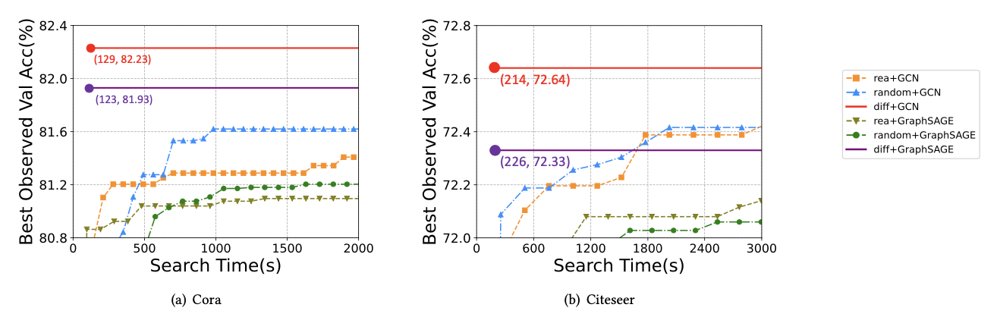

# DA-GDA: Differentiable Automatic Graph Data Augmentation for Semi-Supervised Node Classification

This repository is the official implementation of DA-GDA.

## Requirements

To install requirements:

`pip install -r requirements.txt`

### Training

To train and eval the model in the paper, run commands:

- `python train_search.py`

## Results

Our model achieves the following performance on:

1. Node classification accuracy / micro $F_1$ scorecomparison:

   

2. Efficiency evaluation:

   

3. Robustness evaluation:

   

4. Hyperparameter sensitivity evaluation:

   

5. Ablation study:

   

